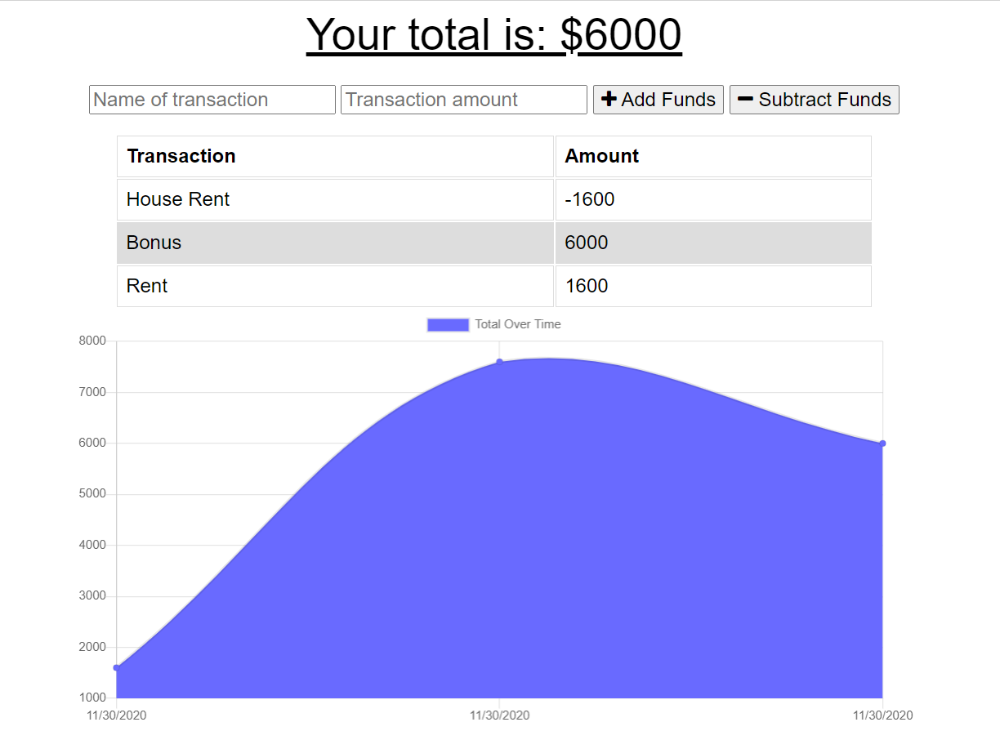

# PWA Online/Offline Budget Trackers

To the existing Budget Tracker application, it has been added extra features and code to allow for offline access and functionality.

Offline Functionality:

  * Enter deposits offline

  * Enter expenses offline

When brought back online:

  * Offline entries should be added to tracker.

## User Story
An avid traveller
WANTS to be able to track his withdrawals and deposits with or without a data/internet connection
SO THAT his account balance is accurate when he is traveling.

## Business Context

Giving users a fast and easy way to track their money is important, but allowing them to access that information anytime is even more important. Having offline functionality is paramount to our applications success.

- - -

### __This is a link to a deployed application:__

_[Click Here for the Heroku’s Deployed Application](https://pwa-budgetapp.herokuapp.com/)_

- - -
### **This is a preview of the app**

